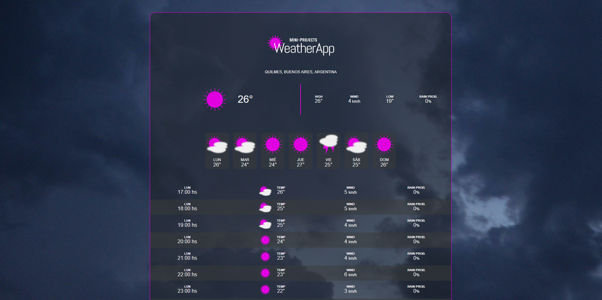

# Weather App

## About this project

This is a project part of my Mini-Projects collection, made with Vite, JavaScript, HTML and CSS.

Weather App with geolocation, daily forecasts and hourly temperatures. Weather information includes:
- Current temperature
- Weather icon
- Max and min temperatures
- Wind speed
- Rain probability

## Screenshots

## Deploy

[Weather App](https://ftweatherapp.vercel.app/)